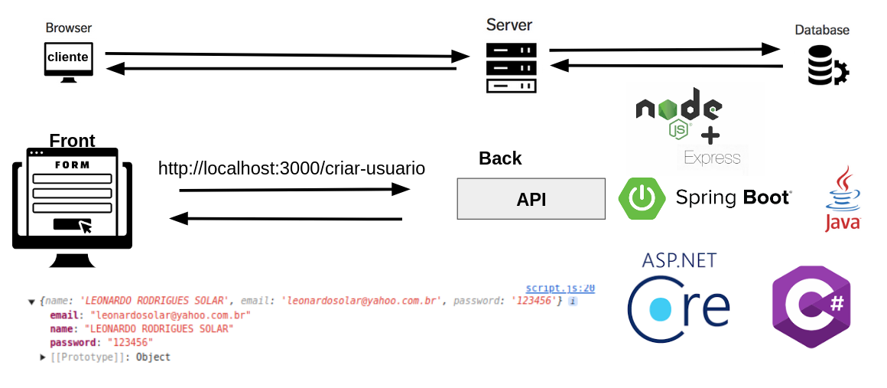

# Aula Geral



# Projeto 1: FrontEnd - Projeto HTML, CSS e Javascript

## Objeto de dados:

Criamos um objeto data com as informações a serem enviadas (nome, senha, valor, e email).

```js
var data = {
    name: "leonardo",
    password: 123456,
    value: true,
    email: "leo@gmail.com",
}
```

## Requisição Fetch:

Usamos a função fetch para enviar os dados ao servidor no endereço 'https://nomedocaminho.com/usuario'.
O método HTTP usado é 'POST', que é usado para enviar dados ao servidor.
O corpo da requisição (body) é o objeto data, que foi convertido para JSON usando JSON.stringify(data). O servidor espera receber os dados nesse formato.

```js
// requisição:
fetch("https://nomedocaminho.com/usuario", {
    // URI
    method: "POST", // método
    body: JSON.stringify(data), // corpo
})
```

## JSON:

O arquivo JSON representado no exemplo é exatamente o que será enviado para o servidor. Ele é uma string que contém as mesmas informações do objeto data.

arquivo json:

```json
{
    "name": "leonardo",
    "password": 123456,
    "value": true,
    "email": "leo@gmail.com"
}
```

Resumindo, o código está enviando uma requisição ao servidor com os dados convertidos para JSON, usando o método POST para enviar essas informações.

# Parte 2: BackEnd - Projeto de uma API

Criando o servidor em Javascript

```js
const express = require("express") // Importa o framework Express

const app = express() // Cria uma nova instância do Express
app.use(express.json()) // Middleware que permite o uso de JSON nas requisições

// Rota GET para visualização
app.get("/", (req, res) => {
    // Define uma rota GET no caminho raiz ('/')
    res.send("Olá, Mundo! Bem-vindo ao Express com JavaScript.") // Responde com uma mensagem de boas-vindas
})

const PORT = 3000 // Define a porta em que o servidor vai rodar
app.listen(PORT, () => {
    // Inicia o servidor e o faz escutar na porta definida
    console.log(`Servidor rodando na porta ${PORT}`) // Exibe uma mensagem no console quando o servidor está ativo
})
```

Este código cria um servidor web básico usando o framework Express em Node.js:

Importa o Express: Utiliza o Express, uma biblioteca que facilita a criação de servidores HTTP.
Cria o servidor: Inicializa o servidor com express().

### Adicionando formato JSON

express.json(): Processa o corpo de requisições JSON, permitindo que a aplicação acesse os dados enviados pelo cliente.
Middleware JSON: Permite que o servidor entenda e processe requisições enviadas em formato JSON.

Middleware: app.use(express.json()):
Propósito: Este middleware permite que o servidor interprete o corpo das requisições HTTP enviadas em formato JSON.
Como funciona: Quando o cliente envia dados em JSON (por exemplo, ao enviar um POST), esse middleware converte esses dados em um objeto JavaScript para que as rotas possam acessar e manipular esses dados de forma fácil.
Por que é útil: Sem esse middleware, o servidor não entenderia o corpo das requisições JSON, e você teria que fazer o parsing manualmente.

### Adicionando o método get

Define uma rota GET: Cria uma rota no caminho '/' (raiz), que responde com a mensagem "Olá, Mundo! Bem-vindo ao Express com JavaScript." quando acessada.
Escuta na porta 3000: O servidor fica "ouvindo" na porta 3000 e, quando iniciado, exibe uma mensagem no console indicando que está funcionando.

# Parte 3: BackEnd - Projeto de uma API

Conectando o front com o back em Javascript

## Adicionando a politica do cors

Permite que o servidor aceite requisições de diferentes origens, facilitando a comunicação entre front-end e back-end em servidores distintos.

```js
const express = require("express") // Importa o framework Express
const cors = require("cors") // Importa o CORS

const app = express() // Cria uma nova instância do Express
app.use(express.json()) // Middleware que permite o uso de JSON nas requisições

// Configura o CORS
app.use(cors()) // Aplica o CORS para permitir requisições de outros domínios

// Rota GET para visualização
app.get("/", (req, res) => {
    // Define uma rota GET no caminho raiz ('/')
    res.send("Olá, Mundo! Bem-vindo ao Express com JavaScript.") // Responde com uma mensagem de boas-vindas
})

const PORT = 3000 // Define a porta em que o servidor vai rodar
app.listen(PORT, () => {
    // Inicia o servidor e o faz escutar na porta definida
    console.log(`Servidor rodando na porta ${PORT}`) // Exibe uma mensagem no console quando o servidor está ativo
})
```

Middleware: app.use(cors())
Propósito: Este middleware habilita o CORS (Cross-Origin Resource Sharing), que permite que o servidor aceite requisições de outros domínios.
Como funciona: Ele adiciona cabeçalhos HTTP às respostas que informam ao navegador que as requisições de outros domínios são permitidas, o que é essencial para aplicações que têm o front-end e o back-end em servidores diferentes.
Por que é útil: Sem CORS, o navegador bloqueia requisições feitas de domínios diferentes (como ao tentar acessar um back-end hospedado em um domínio distinto do front-end).

O que é o CORS e por que isso é importante?
CORS (Cross-Origin Resource Sharing) é um mecanismo de segurança que os navegadores utilizam para permitir ou bloquear requisições feitas por uma página web de um domínio diferente do domínio onde o servidor está rodando.
Sem o CORS configurado, um servidor pode rejeitar requisições de outras origens (domínios), o que é útil por questões de segurança. No entanto, ao habilitar o CORS, você permite que seu servidor aceite essas requisições.

Agora, o seu servidor aceita requisições de outros domínios, o que é útil quando você tem um front-end hospedado em um domínio diferente do back-end. Por exemplo, se o front-end de sua aplicação estiver hospedado em https://meusite.com e o servidor back-end estiver rodando em https://api.meusite.com, com o CORS habilitado, eles podem se comunicar sem restrições.

## Adicionando o método post

```js
const express = require("express") // Importa o framework Express
const cors = require("cors") // Importa o CORS

const app = express() // Cria uma nova instância do Express
app.use(express.json()) // Middleware que permite o uso de JSON nas requisições

// Configura o CORS
app.use(cors()) // Aplica o CORS para permitir requisições de outros domínios

// Rota GET para visualização
app.get("/", (req, res) => {
    // Define uma rota GET no caminho raiz ('/')
    res.send("Olá, Mundo! Bem-vindo ao Express com JavaScript.") // Responde com uma mensagem de boas-vindas
})

// Rota POST para receber dados do usuário
app.post("/criar-usuario", (req, res) => {
    // Define uma rota POST no caminho '/usuario'
    const data = req.body // Extrai os dados enviados no corpo da requisição
    console.log(data) // Exibe os dados no console
    res.send("Dados recebidos com sucesso!") // Envia uma resposta ao cliente
})

const PORT = 3000 // Define a porta em que o servidor vai rodar
app.listen(PORT, () => {
    // Inicia o servidor e o faz escutar na porta definida
    console.log(`Servidor rodando na porta ${PORT}`) // Exibe uma mensagem no console quando o servidor está ativo
})
```

Explicação da rota POST /usuario:
Definição da rota:
app.post('/criar-usuario', (req, res) => { ... }) define uma rota POST no caminho /criar-usuario, ou seja, quando uma requisição POST é feita para esse endereço, o código dentro dessa função será executado.

Extrair dados enviados pelo cliente:
const data = req.body; captura os dados que o cliente enviou no corpo da requisição. Isso só funciona porque você já configurou o middleware express.json(), que converte o corpo da requisição em um objeto JavaScript acessível por req.body.

Exibir os dados no console:
console.log(data); imprime os dados no console do servidor, útil para depuração ou monitoramento.
Enviar uma resposta ao cliente:

res.send('Dados recebidos com sucesso!'); envia uma resposta ao cliente, confirmando que os dados foram recebidos com sucesso.

# Parte 4: BackEnd - Salvando os dados no banco de dados

Conectando o back com o banco de dados

```js
const express = require("express") // Importa o framework Express
const cors = require("cors") // Importa o CORS
const sqlite3 = require("sqlite3").verbose() // Importa o SQLite3

const app = express() // Cria uma nova instância do Express
app.use(express.json()) // Middleware que permite o uso de JSON nas requisições

// Configura o CORS
app.use(cors()) // Aplica o CORS para permitir requisições de outros domínios

// Conecta ao banco de dados SQLite
const db = new sqlite3.Database("./database.db")

// Cria a tabela 'usuarios' se ela ainda não existir
db.run(
    `CREATE TABLE IF NOT EXISTS usuarios (
    id INTEGER PRIMARY KEY AUTOINCREMENT,
    name TEXT NOT NULL,
    email TEXT UNIQUE NOT NULL,
    password TEXT NOT NULL
  )`,
    (err) => {
        if (err) {
            console.error(err.message) // Exibe uma mensagem de erro se ocorrer ao criar a tabela
        } else {
            console.log("Table usuarios created successfully!") // Exibe mensagem se a tabela for criada com sucesso
        }
    }
)

// Rota GET para visualização
app.get("/", (req, res) => {
    // Define uma rota GET no caminho raiz ('/')
    res.send("Olá, Mundo! Bem-vindo ao Express com JavaScript.") // Responde com uma mensagem de boas-vindas
})

// Rota POST para adicionar um usuário ao banco de dados
app.post("/usuario", (req, res) => {
    const data = req.body // Captura os dados do corpo da requisição
    console.log(data) // Exibe os dados no console para depuração

    // Insere um novo usuário na tabela 'usuarios'
    db.run(
        `INSERT INTO usuarios (name, email, password) VALUES (?, ?, ?)`,
        [data.name, data.email, data.password], // Substitui os "?" pelos valores de 'name', 'email' e 'password'
        function (err) {
            if (err) {
                console.error(err.message) // Exibe uma mensagem de erro se a inserção falhar
                res.status(500).json({ error: "Error creating user - back" }) // Retorna um status de erro 500 ao cliente
            } else {
                console.log("Usuário criado com sucesso!") // Exibe uma mensagem de sucesso no console
                rres.status(201).json({ name: data.name }) // Retorna sucesso ao cliente // Retorna uma resposta de sucesso com status 201
            }
        }
    )
})

const PORT = 3000 // Define a porta em que o servidor vai rodar
app.listen(PORT, () => {
    // Inicia o servidor e o faz escutar na porta definida
    console.log(`Servidor rodando na porta ${PORT}`) // Exibe uma mensagem no console quando o servidor está ativo
})
```

Explicação das partes do código:
Conexão com o banco de dados SQLite:

```js
const db = new sqlite3.Database("./database.db")
```

Este comando cria uma conexão com o banco de dados SQLite localizado no arquivo database.db. Se o arquivo não existir, o SQLite cria automaticamente.
Criação da tabela 'usuarios':

```js
db.run(
    `CREATE TABLE IF NOT EXISTS usuarios (
    id INTEGER PRIMARY KEY AUTOINCREMENT,
    name TEXT NOT NULL,
    email TEXT UNIQUE NOT NULL,
    password TEXT NOT NULL
  )`,
    (err) => {
        if (err) {
            console.error(err.message)
        } else {
            console.log("Table usuarios created successfully!")
        }
    }
)
```

Este trecho cria a tabela usuarios com quatro colunas: id, name, email, e password. Se a tabela já existir, nada é feito. Caso contrário, ela é criada.
A coluna id é a chave primária e se incrementa automaticamente para cada novo registro.
O campo email é único, ou seja, dois usuários não podem ter o mesmo email no banco de dados.
Rota POST para inserção de dados:

```js
app.post("/usuario", (req, res) => {
    const data = req.body
    db.run(
        `INSERT INTO usuarios (name, email, password) VALUES (?, ?, ?)`,
        [data.name, data.email, data.password],
        function (err) {
            if (err) {
                console.error(err.message)
                res.status(500).send("Error creating user")
            } else {
                console.log("User created successfully!")
                res.status(201).send("User created successfully!")
            }
        }
    )
})
```

Esta rota recebe uma requisição POST com os dados de um usuário no corpo da requisição (req.body).
O comando SQL INSERT INTO usuarios (name, email, password) VALUES (?, ?, ?) insere os dados recebidos (nome, email e senha) na tabela usuarios.
Os valores de data.name, data.email, e data.password substituem os pontos de interrogação ? na query SQL.
Se houver um erro (por exemplo, um email duplicado), a resposta será um erro 500, indicando que houve um problema ao criar o usuário.
Caso contrário, a resposta será um status 201, indicando que o usuário foi criado com sucesso.
Resumo:
O código conecta o Express com o SQLite3.
Ele cria uma tabela de usuários, caso ela não exista, e configura uma rota POST para permitir a criação de novos usuários.
Quando um novo usuário é enviado na requisição POST, seus dados são armazenados no banco de dados SQLite, e uma resposta de sucesso ou erro é enviada ao cliente.

# Visualizando os dados no arquivo database.db

Instale no vscode a extensão:SQLite Viewer
Clique no arquivo :database.db
Clique na tabela usuario
